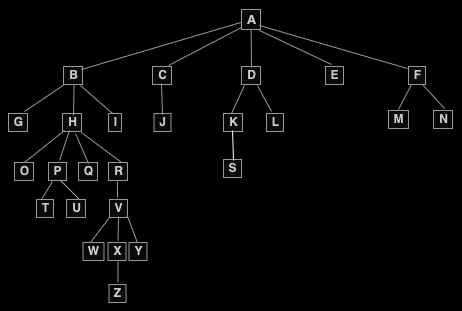

## Depth-first Search

### Description

You're given a `Node` class that has a `name` and an array of optional `children` nodes. When put together, nodes form an acyclic tree-like structure.

Implement the `depthFirstSearch` method on the `Node` class, which takes in an empty array, traverses the tree using the Depth-first Search approach (specifically navigating the tree from left to right), stores all of the nodes' names in the input array, and returns it.

If you're unfamiliar with Depth-first Search, we recommend watching the Conceptual Overview section of this question's video explanation before starting to code.

### Sample Input

```
graph = A
     /  |  \
    B   C   D
   / \     / \
  E   F   G   H
     / \   \
    I   J   K
```

### Sample Output

```
["A", "B", "E", "F", "I", "J", "C", "D", "G", "K", "H"]
```

## Solution

Time and space complexity:

- time **O(v + e)**
- space **O(v)**

where `v` is the number of vertices of the input graph and `e` is the number of edges of the input graph.

### Helper

Visualization of second graph:



```rust
use std::cell::RefCell;
use std::rc::Rc;

#[derive(Debug, PartialEq, Eq)]
pub struct Node {
    pub name: String,
    pub children: Vec<Option<Rc<RefCell<Node>>>>,
}

impl Node {
    #[inline]
    pub fn new(name: String, children: Vec<Option<Rc<RefCell<Node>>>>) -> Self {
        Node { name, children }
    }
}

pub struct Solution;

impl Solution {
    pub fn depth_first_search(node: Option<Rc<RefCell<Node>>>, array: Vec<String>) -> Vec<String> {
        let mut tmp_array = array;

        if let Some(n) = node {
            let name = n.borrow_mut().name.clone();
            let children = n.borrow_mut().children.clone();

            tmp_array.push(name);
            for child in children {
                tmp_array = Solution::depth_first_search(child, tmp_array);
            }
        }

        tmp_array
    }
}

fn main() {
    //        A
    //     /  |  \
    //    B   C   D
    //   / \     / \
    //  E   F   G   H
    //     / \   \
    //    I   J   K

    let node1_k = Node::new(String::from("K"), vec![]);
    let node1_j = Node::new(String::from("J"), vec![]);
    let node1_i = Node::new(String::from("I"), vec![]);
    let node1_h = Node::new(String::from("H"), vec![]);
    let node1_g = Node::new(
        String::from("G"),
        vec![Some(Rc::new(RefCell::new(node1_k)))],
    );
    let node1_f = Node::new(
        String::from("F"),
        vec![
            Some(Rc::new(RefCell::new(node1_i))),
            Some(Rc::new(RefCell::new(node1_j))),
        ],
    );
    let node1_e = Node::new(String::from("E"), vec![]);
    let node1_d = Node::new(
        String::from("D"),
        vec![
            Some(Rc::new(RefCell::new(node1_g))),
            Some(Rc::new(RefCell::new(node1_h))),
        ],
    );
    let node1_c = Node::new(String::from("C"), vec![]);
    let node1_b = Node::new(
        String::from("B"),
        vec![
            Some(Rc::new(RefCell::new(node1_e))),
            Some(Rc::new(RefCell::new(node1_f))),
        ],
    );
    let node1_a = Node::new(
        String::from("A"),
        vec![
            Some(Rc::new(RefCell::new(node1_b))),
            Some(Rc::new(RefCell::new(node1_c))),
            Some(Rc::new(RefCell::new(node1_d))),
        ],
    );

    // second graph
    let node2_z = Node::new(String::from("Z"), vec![]);
    let node2_y = Node::new(String::from("Y"), vec![]);
    let node2_x = Node::new(
        String::from("X"),
        vec![Some(Rc::new(RefCell::new(node2_z)))],
    );
    let node2_w = Node::new(String::from("W"), vec![]);
    let node2_v = Node::new(
        String::from("V"),
        vec![
            Some(Rc::new(RefCell::new(node2_w))),
            Some(Rc::new(RefCell::new(node2_x))),
            Some(Rc::new(RefCell::new(node2_y))),
        ],
    );
    let node2_u = Node::new(String::from("U"), vec![]);
    let node2_t = Node::new(String::from("T"), vec![]);
    let node2_s = Node::new(String::from("S"), vec![]);
    let node2_r = Node::new(
        String::from("R"),
        vec![Some(Rc::new(RefCell::new(node2_v)))],
    );
    let node2_q = Node::new(String::from("Q"), vec![]);
    let node2_p = Node::new(
        String::from("P"),
        vec![
            Some(Rc::new(RefCell::new(node2_t))),
            Some(Rc::new(RefCell::new(node2_u))),
        ],
    );
    let node2_o = Node::new(String::from("O"), vec![]);
    let node2_n = Node::new(String::from("N"), vec![]);
    let node2_m = Node::new(String::from("M"), vec![]);
    let node2_l = Node::new(String::from("L"), vec![]);
    let node2_k = Node::new(
        String::from("K"),
        vec![Some(Rc::new(RefCell::new(node2_s)))],
    );
    let node2_j = Node::new(String::from("J"), vec![]);
    let node2_i = Node::new(String::from("I"), vec![]);
    let node2_h = Node::new(
        String::from("H"),
        vec![
            Some(Rc::new(RefCell::new(node2_o))),
            Some(Rc::new(RefCell::new(node2_p))),
            Some(Rc::new(RefCell::new(node2_q))),
            Some(Rc::new(RefCell::new(node2_r))),
        ],
    );
    let node2_g = Node::new(String::from("G"), vec![]);
    let node2_f = Node::new(
        String::from("F"),
        vec![
            Some(Rc::new(RefCell::new(node2_m))),
            Some(Rc::new(RefCell::new(node2_n))),
        ],
    );
    let node2_e = Node::new(String::from("E"), vec![]);
    let node2_d = Node::new(
        String::from("D"),
        vec![
            Some(Rc::new(RefCell::new(node2_k))),
            Some(Rc::new(RefCell::new(node2_l))),
        ],
    );
    let node2_c = Node::new(
        String::from("C"),
        vec![Some(Rc::new(RefCell::new(node2_j)))],
    );
    let node2_b = Node::new(
        String::from("B"),
        vec![
            Some(Rc::new(RefCell::new(node2_g))),
            Some(Rc::new(RefCell::new(node2_h))),
            Some(Rc::new(RefCell::new(node2_i))),
        ],
    );
    let node2_a = Node::new(
        String::from("A"),
        vec![
            Some(Rc::new(RefCell::new(node2_b))),
            Some(Rc::new(RefCell::new(node2_c))),
            Some(Rc::new(RefCell::new(node2_d))),
            Some(Rc::new(RefCell::new(node2_e))),
            Some(Rc::new(RefCell::new(node2_f))),
        ],
    );

    assert_eq!(
        Solution::depth_first_search(Some(Rc::new(RefCell::new(node1_a))), vec![]),
        vec!["A", "B", "E", "F", "I", "J", "C", "D", "G", "K", "H"]
    );
    assert_eq!(
        Solution::depth_first_search(Some(Rc::new(RefCell::new(node2_a))), vec![]),
        vec![
            "A", "B", "G", "H", "O", "P", "T", "U", "Q", "R", "V", "W", "X", "Z", "Y", "I", "C",
            "J", "D", "K", "S", "L", "E", "F", "M", "N"
        ]
    );
}
```
